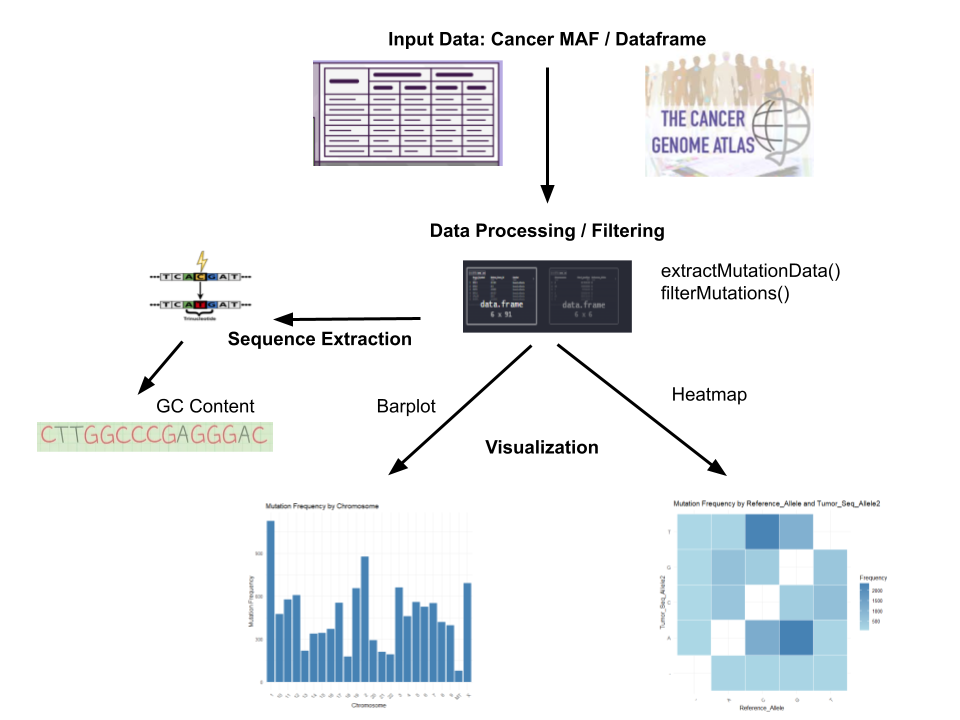

<!-- README.md is generated from README.Rmd. Please edit that file -->

```{r, include = FALSE}
knitr::opts_chunk$set(
  collapse = TRUE,
  comment = "#>",
  fig.path = "man/figures/README-",
  out.width = "100%"
)
```
# CancerMutAnalyzer
Cancer Mutation Analysis and Visualization Suite.

<!-- badges: start -->
<!-- https://www.codefactor.io/repository/github/martien2kk/CancerMutAnalyzer/issues -->
[](https://github.com/martien2kk/CancerMutAnalyzer/issues)  [](./LICENSE)  

<!-- https://shields.io/category/license -->
<!-- badges: end -->

## Description

The `CancerMutAnalyzer` is an R package designed to streamline and enhance the workflow for analyzing mutation data in cancer research. The package focuses on processing, visualizing, and analyzing mutation frequencies and genomic contexts, particularly targeting single nucleotide polymorphisms (SNPs) and other mutation types within cancer datasets. By providing functions for data extraction, filtering, sequence analysis, and visualizations (such as heatmaps of mutation frequencies), the package enables researchers to quickly identify mutation patterns and genomic signatures associated with different cancer types or tumor samples.
<br>
<br>
<br>
This package adds to the current bioinformatics workflow by simplifying mutation analysis tasks that typically require multiple steps across various software. By centralizing these steps in one package, researchers can conduct analyses more efficiently, reduce the risk of errors from file conversions, and gain insights through streamlined visualizations. One unique feature of this package is the ability to examine the local nucleotide context surrounding mutations, which can be used to detect mutational hotspots or enrich mutation data with GC content or sequence-based patterns. Additionally, it addresses common issues such as data formatting, base filtering, and customized visualization for specific mutation characteristics, making it a comprehensive and user-friendly tool for cancer genomics.
<br>
<br>
<br>
The `CancerMutAnalyzer` package was developed using `R version 4.4.1 (2024-06-14 ucrt)`, `Platform: x86_64-w64-mingw32/x64` and `Running under: Windows 11 x64 (build 22631)`.


## Installation

To install the latest version of the package:
``` r
install.packages("devtools")
library("devtools")
devtools::install_github("martien2kk/CancerMutAnalyzer", build_vignettes = TRUE)
library("CancerMutAnalyzer")
```
To run the Shiny app:
``` r
runCancerMutAnalyzer() # not for Assessment 4; only for Assessment 5
``` 


## Overview

``` r
ls("package:CancerMutAnalyzer")
data(package = "CancerMutAnalyzer") 
browseVignettes("CancerMutAnalyzer")
```
`CancerMutAnalyzer` contains 6 functions.

1.  ***extractMutationData***: allows users to specify and extract specific columns from a mutation dataset in Mutation Annotation Format (MAF) or tabular format. It has default settings for commonly used columns but is customizable, so users can focus on relevant mutation details.

2.  ***filterMutations***: provides flexible filtering based on user-specified conditions for any column. This allows users to subset mutation data based on exact values or numeric ranges for certain columns, such as specific genes or chromosomal regions.

3.  ***extractMutationSequences***: retrieves nucleotide sequences surrounding mutation sites from the hg19 genome based on specified genomic coordinates in a data frame. Users can customize the length of the sequence extracted by adjusting the padding parameter, with the default setting providing a trinucleotide sequence centered around each mutation.

4. ***visualizeMutationFrequencyBar***: generates a bar plot to display the frequency of mutations based on a specified column in a mutation dataset. This function is ideal for visualizing the distribution of mutations by a single categorical variable, such as chromosome or variant type.

5. ***visualizeMutationFrequencyHeatmap***: creates a heatmap that visualizes mutation frequency based on two specified columns, such as Reference_Allele and Tumor_Seq_Allele2. It only includes rows where both columns contain nucleotide bases (A, T, C, G). This function is particularly useful for examining mutation patterns between pairs of alleles, highlighting high-frequency mutations across different nucleotide pairs.

6. ***calculateGCContent***: calculates the GC content (the percentage of G and C bases) for each sequence around a mutation site.

The package also contains two cancer mutation datasets, called UCS.mutations and filteredUCSFirst100SNP. Refer to package vignettes for more details. An overview of the package is illustrated below. 




## Contributions

The author of the package is Keren Zhang. The author wrote the extractMutationData function, which extracts specified columns from a mutation dataset, returning key mutation details such as chromosome, start and end positions, variant type, and allele information. This function relies on dplyr functions for data manipulation and selection.
<br>
<br>
The extractMutationSequences function was also developed by the author and extracts nucleotide sequences surrounding mutation sites based on genomic coordinates. This function utilizes the BSgenome.Hsapiens.UCSC.hg19 and GenomicRanges packages to access the hg19 genome and create genomic ranges for accurate sequence extraction.
<br>
<br>
Additionally, the calculateGCContent function, written by the author, calculates the GC content of extracted sequences to assess the percentage of G and C bases. This function uses the Biostrings package for efficient sequence handling and base frequency calculation, allowing for streamlined GC content analysis.
<br>
<br>
The visualizeMutationFrequencyBar and visualizeMutationFrequencyHeatmap functions generate visualizations to explore mutation data. The bar plot function visualizes mutation frequency by a single column, while the heatmap function visualizes mutation frequency by two columns (e.g., Reference_Allele and Tumor_Seq_Allele2). Both functions use ggplot2 for visualization and rely on dplyr for data preparation.
<br>
<br>
Generative AI tools, OpenAI's ChatGPT, were used to provide suggestions for brainstorming, debugging, and structuring the Roxygen documentation. 

## References
- Attali D (2021). _shinyjs: Easily Improve the User Experience of Your Shiny Apps
  in Seconds_. R package version 2.1.0,
  <https://CRAN.R-project.org/package=shinyjs>.
  
- Carey V, Harshfield B, Falcon S, Arora S, Shepherd L (2024). _biocViews:
  Categorized views of R package repositories_. doi:10.18129/B9.bioc.biocViews
  <https://doi.org/10.18129/B9.bioc.biocViews>, R package version 1.72.0,
  <https://bioconductor.org/packages/biocViews>
  
- Chang W, Cheng J, Allaire J, Sievert C, Schloerke B, Xie Y, Allen J, McPherson J,
  Dipert A, Borges B (2024). _shiny: Web Application Framework for R_. R package
  version 1.9.1.9000, commit 501b012b2b82c0c468dc921ff0a3d9a682c20623,
  <https://github.com/rstudio/shiny>
  
- Kosinski M (2024). _RTCGA.mutations: Mutations datasets from The Cancer Genome Atlas Project_.
  doi:10.18129/B9.bioc.RTCGA.mutations <https://doi.org/10.18129/B9.bioc.RTCGA.mutations>, R package version
  20151101.34.0, <https://bioconductor.org/packages/RTCGA.mutations>.
  

- Lawrence M, Huber W, Pag\`es H, Aboyoun P, Carlson M, et al. (2013) Software for Computing and Annotating
  Genomic Ranges. PLoS Comput Biol 9(8): e1003118. doi:10.1371/journal.pcbi.1003118
  
- OpenAI. (2024). _ChatGPT (Version 3.5)_. Retrieved from https://chat.openai.com/chat


- Pagès H, Lawrence M, Aboyoun P (2024). _S4Vectors: Foundation of vector-like and list-like containers in
  Bioconductor_. doi:10.18129/B9.bioc.S4Vectors <https://doi.org/10.18129/B9.bioc.S4Vectors>, R package
  version 0.42.1, <https://bioconductor.org/packages/S4Vectors>.
  

- R Core Team (2024). _R: A Language and Environment for Statistical Computing_. R Foundation for Statistical
  Computing, Vienna, Austria. <https://www.R-project.org/>.

- Silva A. (2019). GitHub - anjalisilva/TestingPackage: R Package Illustrating Components of an R package for BCB410H - Applied Bioinformatics (2019-2023), University of Toronto, Canada. GitHub. https://github.com/anjalisilva/TestingPackage
  
- Team TBD (2020). _BSgenome.Hsapiens.UCSC.hg19: Full genome sequences for Homo sapiens (UCSC version hg19,
  based on GRCh37.p13)_. R package version 1.4.3.
  

-  Wickham, H., François, R., Henry, L., Müller, K., & Vaughan, D. (2023). _dplyr: A Grammar of Data Manipulation_ (R package version 1.1.4). Retrieved from https://CRAN.R-project.org/package=dplyr

- Wickham, H. (2016). _ggplot2: Elegant Graphics for Data Analysis_. New York, NY: Springer-Verlag.

- Wickham, H. and J. Bryan (2019). *R Packages* (2nd edition). Newton, Massachusetts: O'Reilly Media. https://r-pkgs.org/


## Acknowledgements

This package was developed as part of an assessment for 2024 BCB410H: Applied Bioinformatics course at the University of Toronto, Toronto, CANADA. `CancerMutAnalyzer` welcomes issues, enhancement requests, and other contributions. To submit an issue, use the [GitHub issues](https://github.com/martien2kk/CancerMutAnalyzer/issues). Many thanks to those who provided feedback to improve this package.

## SessionInfo

The sessionInfo used to develop this package is listed below:
<br>
<br>

``` r
R version 4.4.1 (2024-06-14 ucrt)
Platform: x86_64-w64-mingw32/x64
Running under: Windows 11 x64 (build 22631)

Matrix products: default


locale:
[1] LC_COLLATE=English_Canada.utf8  LC_CTYPE=English_Canada.utf8    LC_MONETARY=English_Canada.utf8
[4] LC_NUMERIC=C                    LC_TIME=English_Canada.utf8    

time zone: America/Toronto
tzcode source: internal

attached base packages:
[1] stats4    stats     graphics  grDevices utils     datasets  methods   base     

other attached packages:
 [1] CancerMutAnalyzer_0.1.0       knitr_1.48                    Biostrings_2.72.1            
 [4] XVector_0.44.0                testthat_3.2.1.1              ggplot2_3.5.1                
 [7] GenomicRanges_1.56.2          GenomeInfoDb_1.40.1           IRanges_2.38.1               
[10] S4Vectors_0.42.1              BiocGenerics_0.50.0           dplyr_1.1.4                  
[13] RTCGA.mutations_20151101.34.0 RTCGA_1.34.0                  roxygen2_7.3.2               

loaded via a namespace (and not attached):
  [1] rstudioapi_0.17.1                 jsonlite_1.8.9                    magrittr_2.0.3                   
  [4] farver_2.1.2                      rmarkdown_2.29                    fs_1.6.5                         
  [7] BiocIO_1.14.0                     zlibbioc_1.50.0                   vctrs_0.6.5                      
 [10] memoise_2.0.1                     Rsamtools_2.20.0                  RCurl_1.98-1.16                  
 [13] rstatix_0.7.2                     htmltools_0.5.8.1                 S4Arrays_1.4.1                   
 [16] usethis_3.0.0                     curl_5.2.3                        broom_1.0.7                      
 [19] SparseArray_1.4.8                 Formula_1.2-5                     htmlwidgets_1.6.4                
 [22] desc_1.4.3                        zoo_1.8-12                        cachem_1.1.0                     
 [25] commonmark_1.9.2                  GenomicAlignments_1.40.0          whisker_0.4.1                    
 [28] mime_0.12                         lifecycle_1.0.4                   pkgconfig_2.0.3                  
 [31] Matrix_1.7-0                      R6_2.5.1                          fastmap_1.2.0                    
 [34] GenomeInfoDbData_1.2.12           MatrixGenerics_1.16.0             shiny_1.9.1                      
 [37] digest_0.6.37                     colorspace_2.1-1                  ps_1.8.1                         
 [40] rprojroot_2.0.4                   pkgload_1.4.0                     ggpubr_0.6.0                     
 [43] labeling_0.4.3                    fansi_1.0.6                       km.ci_0.5-6                      
 [46] httr_1.4.7                        abind_1.4-8                       compiler_4.4.1                   
 [49] remotes_2.5.0                     withr_3.0.2                       backports_1.5.0                  
 [52] BiocParallel_1.38.0               carData_3.0-5                     viridis_0.6.5                    
 [55] pkgbuild_1.4.5                    ggsignif_0.6.4                    sessioninfo_1.2.2                
 [58] DelayedArray_0.30.1               rjson_0.2.23                      BSgenome.Hsapiens.UCSC.hg19_1.4.3
 [61] tools_4.4.1                       httpuv_1.6.15                     glue_1.8.0                       
 [64] callr_3.7.6                       restfulr_0.0.15                   promises_1.3.0                   
 [67] grid_4.4.1                        generics_0.1.3                    gtable_0.3.6                     
 [70] BSgenome_1.72.0                   KMsurv_0.1-5                      tidyr_1.3.1                      
 [73] survminer_0.5.0                   data.table_1.16.2                 xml2_1.3.6                       
 [76] car_3.1-3                         utf8_1.2.4                        pillar_1.9.0                     
 [79] stringr_1.5.1                     later_1.3.2                       splines_4.4.1                    
 [82] lattice_0.22-6                    survival_3.6-4                    rtracklayer_1.64.0               
 [85] tidyselect_1.2.1                  miniUI_0.1.1.1                    gridExtra_2.3                    
 [88] SummarizedExperiment_1.34.0       xfun_0.49                         Biobase_2.64.0                   
 [91] devtools_2.4.5                    brio_1.1.5                        matrixStats_1.4.1                
 [94] stringi_1.8.4                     UCSC.utils_1.0.0                  yaml_2.3.10                      
 [97] evaluate_1.0.1                    codetools_0.2-20                  tibble_3.2.1                     
[100] BiocManager_1.30.25               cli_3.6.3                         xtable_1.8-4                     
[103] processx_3.8.4                    munsell_0.5.1                     survMisc_0.5.6                   
[106] Rcpp_1.0.13-1                     XML_3.99-0.17                     parallel_4.4.1                   
[109] ellipsis_0.3.2                    assertthat_0.2.1                  profvis_0.4.0                    
[112] urlchecker_1.0.1                  bitops_1.0-9                      viridisLite_0.4.2                
[115] ggthemes_5.1.0                    scales_1.3.0                      purrr_1.0.2                      
[118] crayon_1.5.3                      rlang_1.1.4                       rvest_1.0.4                      
[121] waldo_0.6.0   
```
