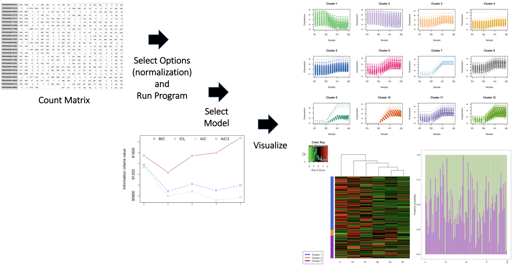

<!-- README.md is generated from README.Rmd. Please edit that file -->

# CancerMutAnalyzer

Cancer Mutation Analysis and Visualization Suite.

<!-- badges: start -->
<!-- https://www.codefactor.io/repository/github/martien2kk/CancerMutAnalyzer/issues -->

[](https://github.com/martien2kk/CancerMutAnalyzer/issues)
[](./LICENSE)


<!-- https://shields.io/category/license -->
<!-- badges: end -->

## Description

The `CancerMutAnalyzer` is an R package designed to streamline and
enhance the workflow for analyzing mutation data in cancer research. The
package focuses on processing, visualizing, and analyzing mutation
frequencies and genomic contexts, particularly targeting single
nucleotide polymorphisms (SNPs) and other mutation types within cancer
datasets. By providing functions for data extraction, filtering,
sequence analysis, and visualizations (such as heatmaps of mutation
frequencies), the package enables researchers to quickly identify
mutation patterns and genomic signatures associated with different
cancer types or tumor samples. <br> <br> <br> This package adds to the
current bioinformatics workflow by simplifying mutation analysis tasks
that typically require multiple steps across various software. By
centralizing these steps in one package, researchers can conduct
analyses more efficiently, reduce the risk of errors from file
conversions, and gain insights through streamlined visualizations. One
unique feature of this package is the ability to examine the local
nucleotide context surrounding mutations, which can be used to detect
mutational hotspots or enrich mutation data with GC content or
sequence-based patterns. Additionally, it addresses common issues such
as data formatting, base filtering, and customized visualization for
specific mutation characteristics, making it a comprehensive and
user-friendly tool for cancer genomics. <br> <br> <br> The
`CancerMutAnalyzer` package was developed using
`R version 4.4.1 (2024-06-14 ucrt)`, `Platform: x86_64-w64-mingw32/x64`
and `Running under: Windows 11 x64 (build 22631)`.

## Installation

Provide the following text and commands, customized to your R package.
E.g., <br> <br> <br> To install the latest version of the package:

``` r
install.packages("devtools")
library("devtools")
devtools::install_github("martien2kk/CancerMutAnalyzer", build_vignettes = TRUE)
library("CancerMutAnalyzer")
```

To run the Shiny app:

``` r
runTestingPackage() # not for Assessment 4; only for Assessment 5
```

## Overview

``` r
ls("package:CancerMutAnalyzer")
data(package = "CancerMutAnalyzer") 
browseVignettes("CancerMutAnalyzer")
```

`CancerMutAnalyzer` contains 6 functions.

1.  ***extractMutationData***: allows users to specify and extract
    specific columns from a mutation dataset in Mutation Annotation
    Format (MAF) or tabular format. It has default settings for commonly
    used columns but is customizable, so users can focus on relevant
    mutation details.

2.  ***filterMutations***: provides flexible filtering based on
    user-specified conditions for any column. This allows users to
    subset mutation data based on exact values or numeric ranges for
    certain columns, such as specific genes or chromosomal regions.

3.  ***extractMutationSequences***: retrieves nucleotide sequences
    surrounding mutation sites from the hg19 genome based on specified
    genomic coordinates in a data frame. Users can customize the length
    of the sequence extracted by adjusting the padding parameter, with
    the default setting providing a trinucleotide sequence centered
    around each mutation.

4.  ***visualizeMutationFrequencyBar***: generates a bar plot to display
    the frequency of mutations based on a specified column in a mutation
    dataset. This function is ideal for visualizing the distribution of
    mutations by a single categorical variable, such as chromosome or
    variant type.

5.  ***visualizeMutationFrequencyHeatmap***: creates a heatmap that
    visualizes mutation frequency based on two specified columns, such
    as Reference_Allele and Tumor_Seq_Allele2. It only includes rows
    where both columns contain nucleotide bases (A, T, C, G). This
    function is particularly useful for examining mutation patterns
    between pairs of alleles, highlighting high-frequency mutations
    across different nucleotide pairs.

6.  ***calculateGCContent***: calculates the GC content (the percentage
    of G and C bases) for each sequence around a mutation site.

The package also contains two cancer mutation datasets, called
UCS.mutations and filteredUCSFirst100SNP. Refer to package vignettes for
more details. An overview of the package is illustrated below.



## Contributions

Provide a paragraph clearly indicating the name of the author of the
package and contributions from the author. Outline contributions from
other packages/sources for each function. Outline contributions from
generative AI tool(s) for each function. Include how the tools were used
and how the results from AI tools were incorporated. Remember your
individual contributions to the package are important. E.g., <br> <br>
<br>

The author of the package is Keren Zhang The author wrote the
*InfCriteriaCalculation* function, which calculates the information
criteria values given data specifications. Here, the Bayesian
information criterion (BIC), Akaike information criterion (AIC) and
Integrated Complete Likelihood (ICL) are calculated. The
*InfCriteriaCalculation* function makes use of map function from
`mclust` R package to generate information criteria values. The `stats`
R package is used for generating multinomially distributed random number
vectors. Part of the code for *InfCriteriaCalculation* function has been
taken from `<NamePackage>` R package. (Section of the borrowed code
should be clearly indicated and referenced in the InfCriteriaCalculation
R script). The *InfCriteriaPlot* is written by the author and generates
a plot of information criteria values. The *InfCriteriaPlot* function
makes use of the `graphics` R package. *NormFactors* is a function that
calculates normalization factors via Trimmed Mean of M-values (TMM).
*NormFactors* function uses Trimmed Mean of M-values (TMM) as
implemented in `edgeR` R package. No generative AI tools were used in
the development of this package.

## References

- Kosinski M (2024). *RTCGA.mutations: Mutations datasets from The
  Cancer Genome Atlas Project*. <doi:10.18129/B9.bioc.RTCGA.mutations>
  <https://doi.org/10.18129/B9.bioc.RTCGA.mutations>, R package version
  20151101.34.0, <https://bioconductor.org/packages/RTCGA.mutations>.

- Lawrence M, Huber W, Pag\`es H, Aboyoun P, Carlson M, et al. (2013)
  Software for Computing and Annotating Genomic Ranges. PLoS Comput Biol
  9(8): e1003118. <doi:10.1371/journal.pcbi.1003118>

- OpenAI. (2024). *ChatGPT (Version 3.5)*. Retrieved from
  <https://chat.openai.com/chat>

- Pagès H, Lawrence M, Aboyoun P (2024). *S4Vectors: Foundation of
  vector-like and list-like containers in Bioconductor*.
  <doi:10.18129/B9.bioc.S4Vectors>
  <https://doi.org/10.18129/B9.bioc.S4Vectors>, R package version
  0.42.1, <https://bioconductor.org/packages/S4Vectors>.

- R Core Team (2024). *R: A Language and Environment for Statistical
  Computing*. R Foundation for Statistical Computing, Vienna, Austria.
  <https://www.R-project.org/>.

- Team TBD (2020). *BSgenome.Hsapiens.UCSC.hg19: Full genome sequences
  for Homo sapiens (UCSC version hg19, based on GRCh37.p13)*. R package
  version 1.4.3.

- Wickham, H., François, R., Henry, L., Müller, K., & Vaughan, D.
  (2023). *dplyr: A Grammar of Data Manipulation* (R package version
  1.1.4). Retrieved from <https://CRAN.R-project.org/package=dplyr>

- Wickham, H. (2016). *ggplot2: Elegant Graphics for Data Analysis*. New
  York, NY: Springer-Verlag.

- Wickham, H. and J. Bryan (2019). *R Packages* (2nd edition). Newton,
  Massachusetts: O’Reilly Media. <https://r-pkgs.org/>

## Acknowledgements

Provide the following text, customized to your R package. E.g., <br>
<br> <br> This package was developed as part of an assessment for 2024
BCB410H: Applied Bioinformatics course at the University of Toronto,
Toronto, CANADA. `CancerMutAnalyzer` welcomes issues, enhancement
requests, and other contributions. To submit an issue, use the [GitHub
issues](https://github.com/martien2kk/CancerMutAnalyzer/issues). Many
thanks to those who provided feedback to improve this package.

## Package Structure

The package structure is illustrated below: <br> <br> The package tree
structure is provided below.

``` r
- TestingPackage
  |- TestingPackage.Rproj
  |- DESCRIPTION
  |- NAMESPACE
  |- LICENSE
  |- README
  |- data
    |- GeneCounts.rda
    |- GeneCounts2.rda
  |- inst
    CITATION
    |- extdata
      |- SILVA_A_A1.png
      |- GeneCountsData2.csv
    |- shiny-scripts 
        |- app.R
  |- man
    |- GeneCounts.Rd
    |- InfCriteriaCalculation.Rd
    |- NormFactors.Rd
    |- InfCriteriaPlot.Rd
  |- R
    |- data.R
    |- InfCriteriaCalculation.R
    |- InfCriteriaPlot.R
    |- NormFactorCalculation.R
  |- vignettes
    |- TestingPackageVignette.Rmd
  |- tests
    |- testthat.R
    |- testthat
      |- test-InfCriteriaCalculation.R
```
